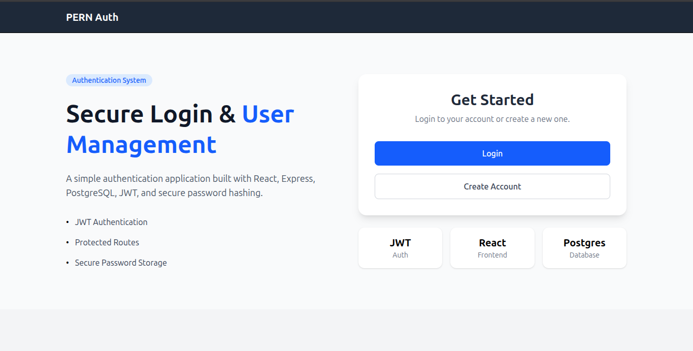
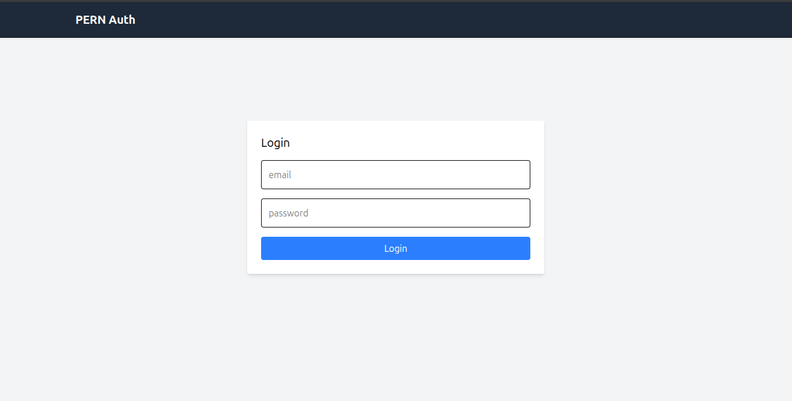
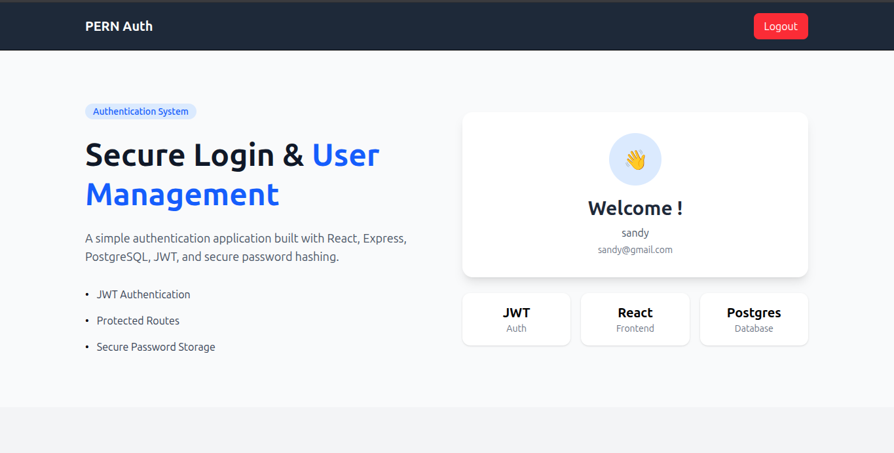

# PERN Authentication App

A full-stack authentication application built with PostgreSQL, Express.js, React, and Node.js.

## Features

- User Registration
- User Login
- JWT Authentication
- Protected Routes
- Responsive UI

## Tech Stack

### Frontend
- React
- React Router
- Axios
- Tailwind CSS

### Backend
- Node.js
- Express.js
- PostgreSQL
- JWT
- bcrypt

## Installation

### Clone Repository

git clone <https://github.com/santhoshkumar-2901/pern-auth.git>

### Backend

cd backend
npm install
npm start

### Frontend

cd frontend
npm install
npm run dev

## Environment Variables

Create a `.env` file in backend:

PORT=
JWT_SECRET=
DATABASE_URL=

## Screenshots

### Home Page

### Login Page

### Register Page

### Authenticated Home Page

## Future Improvements

- Password reset
- Email verification
- User profiles
- OAuth login
